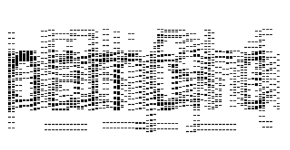

# Artistic warmup

we start by checking the file type, and we find out that we're seeing a PE (as exxpected by the extension),
so we can open it with IDA, at first glance no symbols appear,
so by looking at it's strings we can jump directly to the function that contains both `Invalid flag.\n` and `Valid flag!\n` (`sub_1400BFB00`).
```c
for ( i = 0; i != 90000; ++i )
{
	if ( (*(_BYTE *)(v17 + i) ^ 0xAA) != byte_1400C5020[i] )
	{
		write((int)&stdout, "Invalid flag.\n", 0xEu);
		goto LABEL_5;
	}
}
write((int)&stdout, "Valid flag!\n", 0xCu);
```

it's xorring bytes and checking against `byte_1400C5020` we can set it as an array of 90000 bytes and extract it.
there we see that every byte is 0xAA or 0x00, this could be a black and white image,
trying to visualize it with 300 pixels per row we get a very distorted image:



After fuzzing a little on the size we find that 1800 is ideal:


## Script

```python
import numpy as np
import matplotlib.pyplot as plt

# the exported data from IDA
with open("export_results.bin", "rb") as f:
    data = np.frombuffer(f.read(), dtype=np.uint8)

size = 1800
img = data.reshape((len(data)//size, size))

plt.figure()
plt.imshow(img, cmap="gray")
plt.axis("off")
plt.show()

```

## Flag

`srdnlen{pl5_Charles_w1n_th3_champ1on5hip}`
